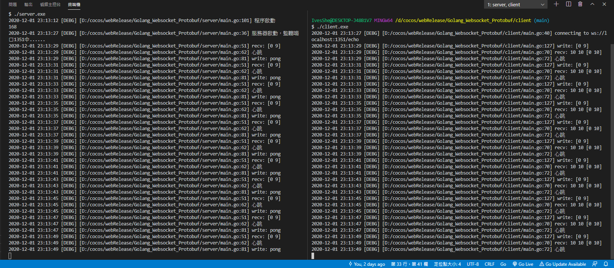

# Golang Websocket 搭配 protobuf

下載並安裝

```shell
go get -u -v github.com/gorilla/websocket
go get -u -v github.com/golang/protobuf/proto
go get -u -v github.com/golang/protobuf/protoc-gen-go
```


下載proto編譯工具
- 參考這篇
https://github.com/IvesShe/Golang_Protobuf

# 執行結果

## 客戶端

發送ping，並在接收到pong時打印"心跳"


## 服務器

服務器接收到ping時，會回傳pong

# 執行畫面



# Server

server.go
```go
///
```

# Client

client.go
```go
///
```

# 小結

使用之前練習的項目，將websocket與protobuf一起練習使用。